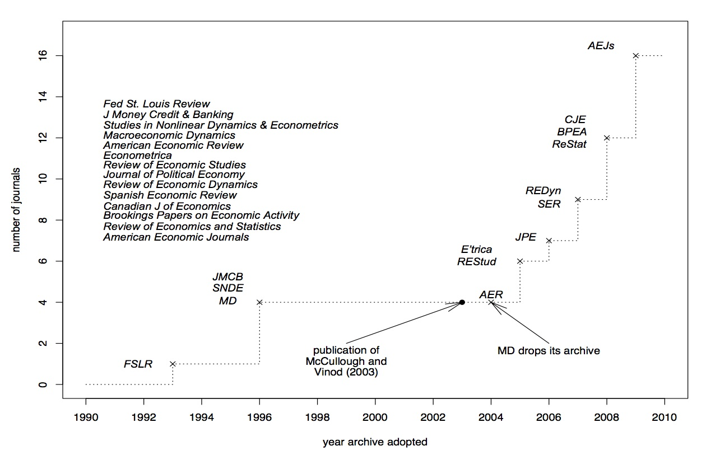

Templates for Reproducible Research: Documentation
==================================================

.. _introduction:

Introduction
------------

An empirical or computational research project only becomes a useful building block for
science and policy when **all** steps can be easily repeated and modified by others.

This means that we should automate as much as possible. Things that should absolutely be
avoided are copying and pasting, pointing and clicking with a mouse, or any researcher
input that goes beyond setting the pipeline to run.

This code base aims to provide two stepping stones to assist you in achieving this goal:

1. A sensible directory structure. This will save you a bunch of thoughtwork and
   structuring of files and directories that needs to be doe sooner or later when
   starting a new project. Put differently, instead of starting from scratch, you modify
   an example for your needs.
2. Facilitate the reproducibility of your research findings from the beginning to
   the end by letting the computer handle the project's workflow.

The first should lure you in quickly, the second should convince you to stick to the
tools in the long run---unless you are familiar with the programs already, you might
think now that all of this is overkill and far more difficult than necessary. It is not.
*[although I am always* `happy to hear <https://www.wiwi.uni-bonn.de/gaudecker/>`_
*about easier alternatives]*

The templates support a variety of programming languages already and are easily extended
to cover any other. Everything is tied together by `pytask
<https://pytask-dev.readthedocs.io>`_, which is written in `Python
<http://www.python.org/>`_. You do not need to know a lot of Python to use these tools,
though.

How to proceed
--------------

If you are a complete novice, you should read carefully through the entire documents.
We suggest starting with the section :ref:`getting_started`. Once you've finished
that you can go to the section with the programming language of your choice. For
example, if you want to work with Python go to the section :ref:`python_section`.

Motivation
----------

The case for reproducibility
############################

The credibility of (economic) research is undermined if erroneous results appear in
respected journals. To quote McCullough and Vinod :cite:`McCulloughVinod2003`:

    *Replication is the cornerstone of science. Research that cannot be replicated is
    not science, and cannot be trusted either as part of the profession’s accumulated
    body of knowledge or as a basis for policy. Authors may think they have written
    perfect code for their bug-free software package and correctly transcribed each data
    point, but readers cannot safely assume that these error-prone activities have been
    executed flawlessly until the authors’ efforts have been independently verified. A
    researcher who does not openly allow independent verification of his results puts
    those results in the same class as the results of a researcher who does share his
    data and code but whose results cannot be replicated: the class of results that
    cannot be verified, i.e., the class of results that cannot be trusted.*

It is sad if not the substance, but controversies about the replicability of results
make it to the first page of the Wall Street Journal :cite:`WSJ2005`, covering the
exchange between Hoxby and Rothstein (:cite:`Hoxby2000` -- :cite:`Rothstein2007comment`
-- :cite:`Hoxby2007` -- :cite:`Rothstein2007rejoinder`). There are some other well-known
cases from top journals, see for example Levitt and McCrary (:cite:`Levitt1997` --
:cite:`McCrary2002` -- :cite:`Levitt2002`) or the experiences reported in McCullough and
Vinod :cite:`McCulloughVinod2003`. The Reinhart and Rogoff controversy is another case
in point, `Google
<https://www.google.com/?gfe_rd=cr&ei=b3YEU4GqIcLa8gfGvYHQCA#q=reinhart+rogoff+excel>`_
is your friend in case you do not remember it. Assuming that the incentives for
replication are much smaller in lower-ranked journals, this is probably just the tip of
the iceberg. As a consequence, many journals have implemented relatively strict
replication policies, see this figure taken from :cite:`McCullough2009`:

   *Economic Journals with Mandatory Data + Code Archives, Figure 1 in*  McCullough
   (2009)

Exchanges such as those above are a huge waste of time and resources. Why waste? Because
it is almost costless to ensure reproducibility from the beginning of a project --- much
is gained by just following a handful of simple rules. They just have to be known. The
earlier, the better.

If one thing has changed since the somewhat dated references, it is that replication
policies are enforced these days. Ensuring that you can follow them only after a paper's
acceptance is rather painful. Hence, if your aim is to publish your work, you should
seriously think about reproducibility from the beginning. And I did not even get started
on research ethics...

Feedback welcome
----------------

I have had a lot of feedback from former students who found this helpful. But in-class
exposure to material is always different than reading up on it and I am sure that there
are difficult-to-understand parts. I would love to hear about them! Please `drop me a
line <mailto:hmgaudecker@gmail.com>`_ or, if you have concrete suggestions, `file an
issue <https://github.com/OpenSourceEconomics/econ-project-templates/issues>`_ on
GitHub.

Structure of the Documentation
------------------------------

.. toctree::
    :maxdepth: 1

    getting_started/index
    languages/python/index
    languages/R/index
    languages/julia/index
    languages/stata/index
    faq
    development/index
    zreferences
