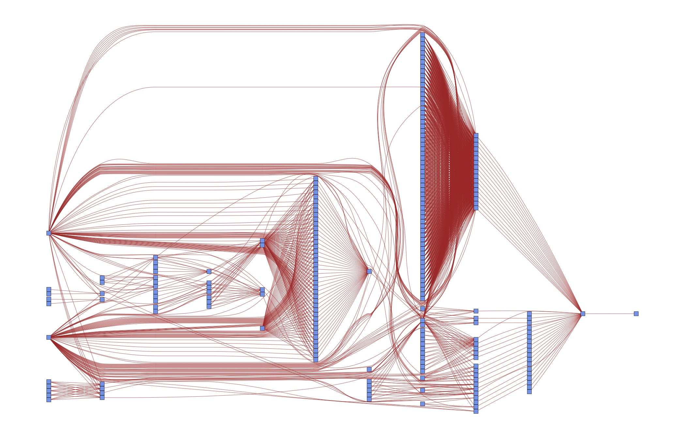

The way to specify dependencies between data, code and tasks to perform for a
computer is a directed acyclic graph. A graph is simply a set of nodes (files,
in our case) and edges that connect pairs of nodes (tasks to perform). Directed
means that the order of how we connect a pair of nodes matters, we thus add
arrows to all edges. Acyclic means that there are no directed cycles: When you
traverse a graph in the direction of the arrows, there may not be a way to end
up at the same node again.

This is the dependency graph for the modified Schelling example from Stachurski
and Sargent, as implemented in the Python branch of the project template:

The arrows have different colors in order to distinguish the steps of the
analysis, from left to right:

* Blue for data management (=drawing a simulated sample, in this case)
* Orange for the main simulation
* Teal for the visualisation of results
* Red for compiling the pdf of the paper

Bluish nodes are pure source files -- they do not depend on any other file and
hence none of the edges originates from any of them. In contrast, brownish
nodes are targets, they are generated by the code. Some may serve as
intermediate targets only -- e.g. there is not much you would want to do with
the raw simulated sample (*initial_locations.csv*) except for processing it
further.

In a first run, all targets have to be generated, of course. In later runs, a
target only needs to be re-generated if one of its direct **dependencies**
changes. E.g. when we make changes to *baseline.json*, we will need to build
*schelling_baseline.pickle* and  *schelling_baseline.png* anew. Depending on
whether *schelling_baseline.png* actually changes, we need to re-compile the
pdf as well. We will dissect this example in more detail in the next section.
The only important thing at this point is to understand the general idea.

Of course this is overkill for a textbook example -- we could easily keep the
code closer together than this. But such a strategy does not scale to serious
papers with many different specifications. As a case in point, consider the DAG
for an early version of :cite:`Gaudecker2015`:

Do you want to keep those dependencies in your head? Or would it be useful to
specify them once and for all in order to have more time for thinking about
research? The next section shows you how to do that.