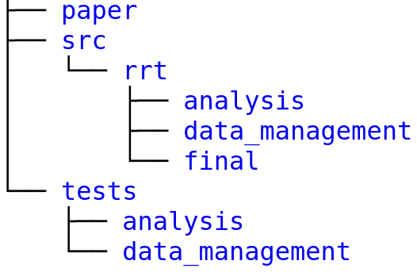
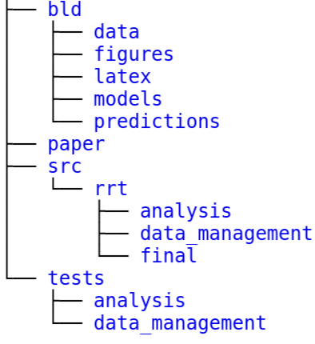

The following graph shows the contents of the example project root directory before
executing ``pytask``:

The following graph shows the contents of the example project root directory **after**
execturing ``pytask``:

It is imperative that you do all the task handling inside the `task_xxx.py`-scripts,
using the `pathlib <https://realpython.com/python-pathlib/>`_ library. This ensures that
your project can be used on different machines and it minimises the potential for
cross-platform errors.

For running Python source code from pytask, simply include `depends_on` and `produces`
as inputs to your function.

For running scripts in other languages, pass all required files (inputs, log files,
outputs) as arguments to the `@pytask.mark.[x]`-decorator. You can then read them in.
Check the sections on different programming languages for examples.
