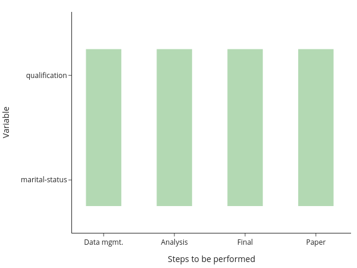
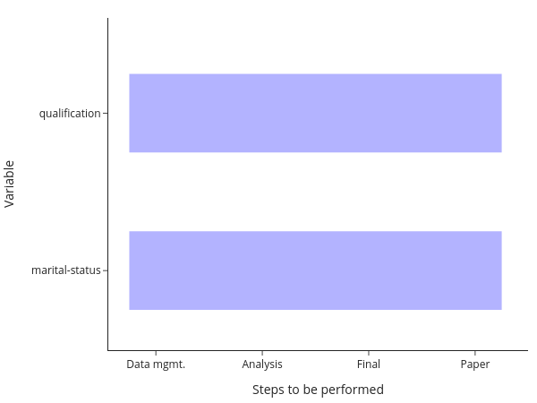
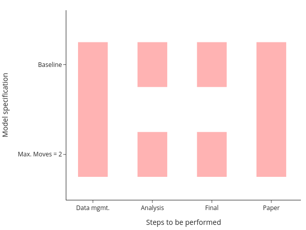

A naive way to ensure reproducibility is to have a *master-script* (do-file, m-file,
...) that runs each file one after the other. One way to implement that for the above
setup would be to have code for each step of the analysis and a loop over both models
within each step:

.. comment:: What is a master-script?

You will still need to manually keep track of whether you need to run a
particular step after making changes, though. Or you run everything at once,
all the time. Alternatively, you may have code that runs one step after the
other for each model:

.. comment:: How do I manually keep track?

The equivalent comment applies here: Either keep track of which model needs to
be run after making changes manually, or run everything at once.

Ideally though, you want to be even more fine-grained than this and only run
individual elements. This is particularly true when your entire computations
take some time. In this case, running all steps every time via the
*master-script* simply is not an option. All my research projects ended up
running for a long time, no matter how simple they were... The figure shows you
that even in this simple example, there are now quite a few parts to remember:

This figure assumes that your data management is being done for all models at
once, which is usually a good choice for me. Even with only two models, we need
to remember 6 ways to start different programs and how the different tasks
depend on each other. **This does not scale to serious projects!**
