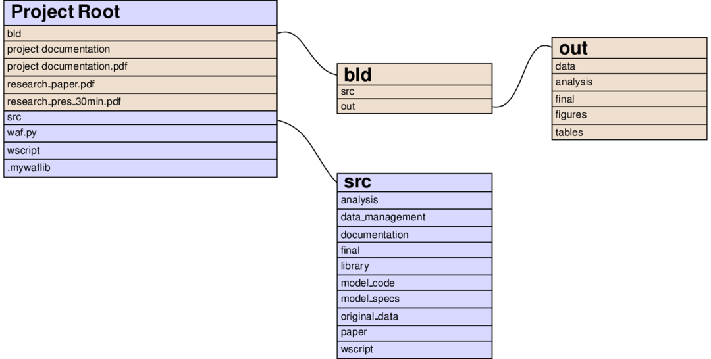
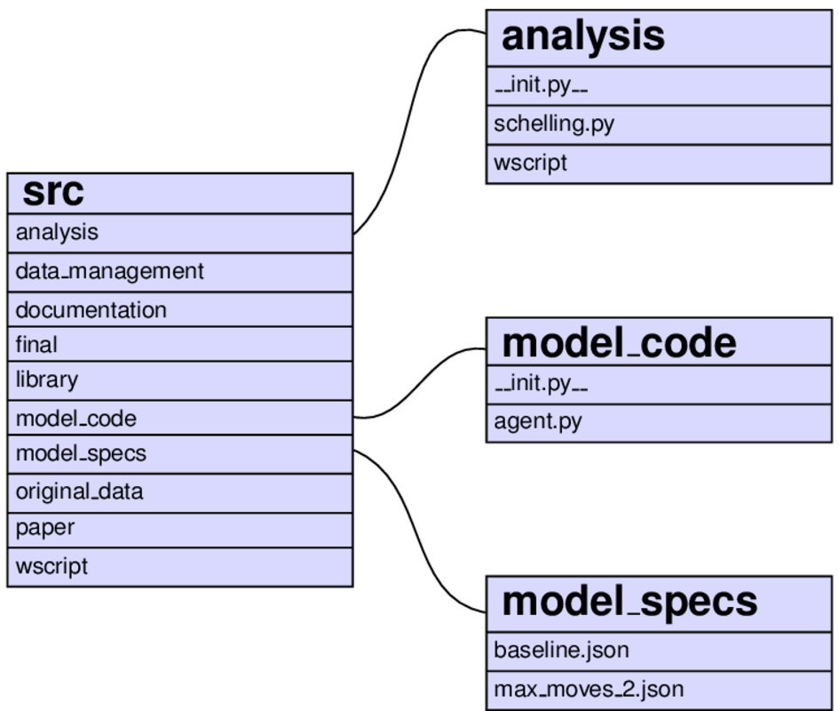

On this page, we first describe how the files are distributed in the directory hierarchy. We then move on to show how to find your way around using simple data structures in the :ref:`project_paths` section, so that you just need to make changes in a single place (remember to minimise code repetition!).

.. _directory_structure:

Directory structure
-------------------

The left node of the following graph shows the contents of the project root directory after executing ``python waf.py configure build install``:

Files and directories in brownish colours are constructed by Waf; those with a bluish background are added directly by the researcher. You immediately see the **separation of inputs and outputs** (one of our guiding principles) at work:

    * All source code is in the *src* directory.
    * All outputs are constructed in the *bld* directory.
    * The other objects in square brackets are put there during Waf's install phase, so that they can be opened easily (paper, presentation, documentation).
    * The remainder is made up of objects related to Waf:

        * *waf.py* is the file that starts up Waf (you will never need to change it).
        * *wscript* is the main entry point for the instructions we give to Waf.
        * *.mywaflib* contains Waf's internals.

The contents of both the *root/bld/out* and the *root/src* directories directly follow the steps of the analysis from the :ref:`workflow <workflow>` section (you can usually ignore the *ro../../bld* directory, except when you need to take a look at LaTeX log-files).

The idea is that everything that needs to be run during the, say, **analysis** step, is specified in *root/src/analysis* and all its output is placed in *root/bld/out/analysis*.

Some differences:

    * Because they are accessed frequently, *figures* and *tables* get extra directories in *root/bld/out* next to *final*
    * The directory *root/src* contains many more subdirectories:

        * *original_data* is the place to store the data in its raw form, as downloaded / transcribed / ... The original data should **never** be modified and saved under the same name.
        * *model_code* contains source files that might differ by model and that are potentially used at various steps of the analysis.
        * *model_specs* contains `JSON <http://www.json.org/>`_ files with model specifications. The choice of JSON is motivated by the attempt to be language-agnostic: JSON is quite expressive and there are parsers for nearly all languages (for Stata there is a converter in the *wscript* file of the Stata version of the template)
        * *library* provides code that may be used by different steps of the analysis. Little code snippets for input / output or stuff that is not directly related to the model would go here. The distinction from the *model_code* directory is a bit arbitrary, but I have found it useful in the past.

As an example of how things look further down in the hierarchy, consider the *analysis* step that was described :ref:`in the section on Waf <waf_analysis>`:

Remember that the script *root/src/analysis/schelling.py* is run with an argument *baseline* or *max_moves_2*. The code then accesses the respective file in *root/src/model_specs*, *root/src/model_code/agent.py*, and *bld/out/data/initial_locations.csv* (not shown). These are many different locations to keep track of; your project organisation will change as your project evolves and typing in entire paths at various locations is cumbersome. The next sections shows how this is solved in the project template.

.. _project_paths:

Project paths
--------------

The first question to ask is whether we should be working with absolute or relative paths. Let us first consider the pros and cons of each.

    * **Relative paths** (e.g., *..\\model_code\\agent.py* or *../../model_code/agent.py*)

        * **Pro**: Portable across machines; provide abstraction from irrelevant parts of underlying directory structure.
        * **Con**: Introduction of *state* (the directory used as starting point), which is bad for maintainability and reproducibility.

    * **Absolute paths** (e.g., *C:\\projects\\schelling\\src\\model_code\\agent.py* or */Users/xxx/projects/schelling/src/model_code/agent.py*)

        * **Pro**: Any file or directory is unambiguously specified.
        * **Con**: Not portable across machines.

The project template combines the best of both worlds by requiring you to specify relative paths for all often-accessed locations in the main *wscript* file. These are then used throughout the project template -- both in the *wscript* files and in any substantial code. The next sections show how to specify them and how to use them in different circumstances.

Specifying project paths in the main *wscript* file
---------------------------------------------------

This is how the project paths are specified in the main wscript file:

.. literalinclude:: ../bld/example/python/python_example/wscript
    :start-after: # The project root directory and the build directory.
    :end-before: def path_to

All these paths are relative to the project root, so you can directly use them on many different machines. Note the distinction between *IN* and *OUT* in the keys and that we prefix all of the latter by *bld*.

The mappings from input to output by step of the analysis should be easy enough from the names:

    1. **data_management**, **original_data** → **OUT_DATA**
    2. **analysis** → **OUT_ANALYSIS**
    3. **final** → **OUT_FINAL**, **OUT_FIGURES**, **OUT_TABLES**

In addition, there are the "special" input directories *library*, *model_code*, and *model_specs*, of course.

Usage of the project paths within *wscript* files
-------------------------------------------------

The first thing to do is to make these project paths available in *wscript* files further down the directory hierarchy. We do so in the *build* function of *root/wscript*; the relevant lines are:

.. literalinclude:: ../bld/example/python/python_example/wscript
    :start-after: ctx.load("write_project_headers")
    :end-before: # Generate header

The first line of the function attaches the project paths we defined in the previous section to the build context object. The second attaches a convenience function to the same object, which will do all the heavy lifting. You do not need to care about its internals, only about its interface:

.. function:: ctx.path_to(ctx, pp_key, *args)
    :noindex:

    Return the relative path to os.path.join(*args*) in the directory
    PROJECT_PATHS[pp_key] as seen from ctx.path (i.e. the directory of the
    current wscript).

    Use this to get the relative path---as needed by Waf---to a file in one
    of the directory trees defined in the PROJECT_PATHS dictionary above.

This description may be a bit cryptic, but it says it all: Waf needs paths relative to the *wscript* where you define a task generator. This function returns it. You always need to supply three arguments:

    #. The build context (completely mechanical, always the same)
    #. The key of the directory you want to access.
    #. The name of the file in the directory. If there is a further hierarchy of directories, separate directory and file names by commas.

Let us look at *root/src/analysis/wscript* as an example again:

.. literalinclude:: ../bld/example/python/python_example/src/analysis/wscript

Note that the order of the arguments is the same in each of the five calls of ``ctx.path_to()``. The last one has an example of a nested directory structure: We do not need the log-files very often and they only clutter up the *OUT_ANALYSIS* directory, so we put them in a subdirectory.

Usage of the project paths in substantial code
----------------------------------------------

The first thing to do is to specify a task generator that writes a header with project paths to disk. This is done using the ``write_project_paths`` feature. The following line is taken from the ``build`` function in *root/wscript*:

.. literalinclude:: ../bld/example/python/python_example/wscript
    :start-after: ctx.path_to
    :end-before: ctx.add_group()

The ``write_project_paths`` feature is smart: It will recognise the syntax for its target by the extension you add to the latter. Currently supported: *.py*, *.do*, *.m*, *.r*, *.pm*.

The paths contained in the resulting file (*root/bld/project_paths.py*) are **absolute** paths, so you do not need to worry about the location of your interpreter etc.

The exact usage varies a little bit by language; see the respective template for examples. In Python, you first import a function called *project_paths_join*::

    from bld.project_paths import project_paths_join as ppj

You can then use it to obtain absolute paths to any location within your project. E.g., for the log-file in the analysis step, you would use::

    ppj("OUT_ANALYSIS", "log", "schelling_{}.log".format(model_name))

When you need to change the paths for whatever reason, you just need to update them once in the main *wscript* file; everything else will work automatically. Even if you need to change the keys -- e.g. because you want to break the *analysis* step into two -- you can easily search and replace *OUT_ANALYSIS* in the entire project.
