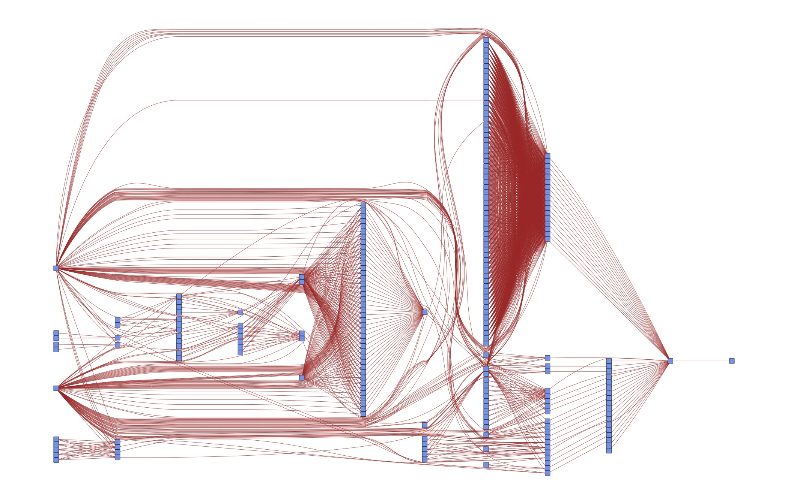

.. _rationale:

****************
Design rationale
****************

The design of the project templates is guided by the following main thoughts:

    #. **Separation of logical chunks** A minimal requirement for a project to scale.
    #. **Only execute required tasks, automatically** Again required for scalability. It means that the machine needs to know what is meant by a "required task".
    #. **Re-use of code and data instead of copying and pasting** Else you will forget the copy & paste step at some point down the road. At best, this leads to errors; at worst, to misinterpreting the results.
    #. **Be as language-agnostic as possible** Make it easy to use the best tool for a particular task and to mix tools in a project.
    #. **Separation of inputs and outputs** Required to find your way around in a complex project.

I will not touch upon the last point until the :ref:`organisation` section below. The remainder of this page introduces an example and a general concept of how to think about the first four points.

Running example
---------------

To fix ideas, let's look at the example of Albouy's :cite:`Albouy12` replication study of Acemoglu, Johnson, and Robinson's (AJR) :cite:`AcemogluJohnsonRobinson01` classic 2001 paper. In his replication, Albouy :cite:`Albouy12` raises two main issues: lack of appropriate clustering and measurement error in the instrument (settler's mortality) that is correlated with exproparation risk and GDP. The replication of Albouy's :cite:`Albouy12` requires two main steps.

    1. Combine Albouy's (2012) and AJR's (2005) data
    2. Replicate tables and figures of Albouy (2012) using this data

For each table, one has to follow two steps:

    1. Compute the estimates considering different set of controls, different subsamples and different standard error specifications.
    2. Put these estimates together in a nicely formatted table.

It is very useful to explictly distinguish between steps 1. and 2. because computation time in 1. becomes an issue: If you just want to change the layout of a table or the color of a line in a graph, you do not want to wait for days. Not even for 3 minutes or 30 seconds as in this example.

.. _workflow:

How to organise the workflow?
-----------------------------

A naïve way to ensure reproducibility is to have a *master-script* (do-file, m-file, ...) that runs each file one after the other. One way to implement that for the above setup would be to have code for each step of the analysis and a loop over the different subsamples within each step:

.. figure:: ../../../bld/examples/r/steps_only_full.png
   :width: 25em

You will still need to manually keep track of whether you need to run a particular step after making changes, though. Or you run everything at once, all the time. Alternatively, you may have code that runs one step after the other for each subsample/specification:

.. figure:: ../../../bld/examples/r/model_steps_full.png
   :width: 25em

The equivalent comment applies here: Either keep track of which model needs to be run after making changes manually, or run everything at once.

Ideally though, you want to be even more fine-grained than this and only run individual elements. This is particularly true when your entire computations take some time. In this case, running all steps every time via the *master-script* simply is not an option. All my research projects ended up running for a long time, no matter how simple they were... The figure shows you that even in this simple example, there are now quite a few parts to remember:

.. figure:: ../../../bld/examples/r/model_steps_select.png
   :width: 25em

This figure assumes that your data management is being done for all models at once, which is usually a good choice for me. Even with only two models, we need to remember 6 ways to start different programs and how the different tasks depend on each other. **This does not scale to serious projects!**

.. _dag_s:

Directed Acyclic Graphs (DAGs)
------------------------------

The way to specify dependencies between data, code and tasks to perform for a computer is a directed acyclic graph. A graph is simply a set of nodes (files, in our case) and edges that connect pairs of nodes (tasks to perform). Directed means that the order of how we connect a pair of nodes matters, we thus add arrows to all edges. Acyclic means that there are no directed cycles: When you traverse a graph in the direction of the arrows, there may not be a way to end up at the same node again.

This is the dependency graph for the modified Schelling example from Stachurski and Sargent, as implemented in the Python branch of the project template:

.. figure:: ../../../bld/examples/r/ajrcomment_dependencies.png
   :width: 50em

The arrows have different colors in order to distinguish the steps of the analysis, from left to right:

    * Blue for data management (=combining the data sets in this case)
    * Orange for the main estimation
    * Teal for the visualisation of results
    * Red for compiling the pdf of the paper

Bluish nodes are pure source files -- they do not depend on any other file and hence none of the edges originates from any of them. In contrast, brownish nodes are targets, they are generated by the code. Some may serve as intermediate targets only -- e.g. there is not much you would want to do with the ajrcomment.dta except for processing it further.

In a first run, all targets have to be generated, of course. In later runs, a target only needs to be re-generated if one of its direct **dependencies** changes. E.g. when we make changes to *baseline.json*, we will need to rerun *first_stage_estimation.r* and  *second_stage_estimation.r* using this subsample/specification. Then we will need to rerun *table2_first_stage_est.r* and *table3_second_stage_est.r* to renew *table2_first_stage_est.tex* and *table3_first_stage_est.tex*. Lastly, we need to re-compile the pdf as well. We will dissect this example in more detail in the next section. The only important thing at this point is to understand the general idea.

Of course this is overkill for a textbook example -- we could easily keep the code closer together than this. But such a strategy does not scale to serious papers with many different specifications. As a case in point, consider the DAG for an early version of :cite:`Gaudecker14`:

Do you want to keep those dependencies in your head? Or would it be useful to specify them once and for all in order to have more time for thinking about research? The next section shows you how to do that.
